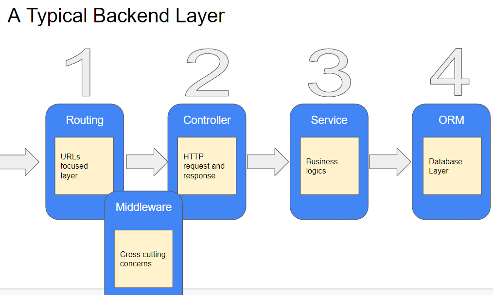
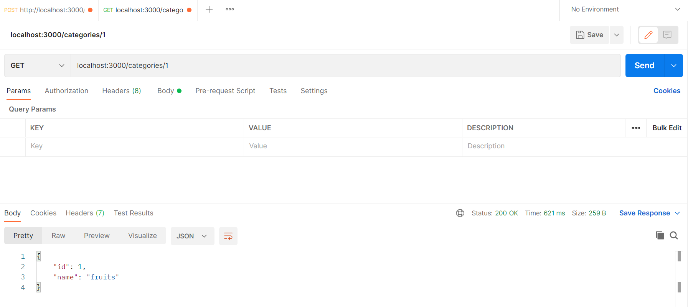

## Brief

### Preparation

Install Express, Sequelize, and the appropriate drivers for the database. *Note: Do not forget to do `npm init` as well as adding a start script in `package.json`*

Note that npm can install multiple libraries at the same time.

`npm install express sequelize pg pg-hstore`

The `ecommerce` database with the `items` and `categories` tables will be used for this session.

### Lesson Overview

The lesson focuses on creating an end-to-end backend workflow by integrating Sequelize with Express. The learners will be using an n-tier layered architecture for the server to separate the functionalities into routes, controllers, and models.

---

## Part 1 - Folder setup

*Note: An N-tier layer is up to the developer on how many layers are going to be used. For this project, the server will have 3 tiers for routes, controllers and models. Some developers would add a service layer to move the business logic separate from the controller and the controller will be cleaning up the request as needed.*

A backend server consists of the endpoints that will be consumed, the business logic to process the requests, and the database to write and retrieve data from.



For this lesson, we will be creating a 3-layer architecture. The controller will be handling the role of the controller and the service where the business logic would happen.

Create three folders (routes, controllers, models) and an index.js. The index.js will act as the starting point for the server.

```js
//index.js
const express = require('express');
const categoryRoutes = require("./routes/categoryRoutes");

const app = express();
const port = 3000;
app.use(express.json());

app.listen(port, () => {
  console.log(`App listening on port ${port}`)
});
```

---

## Part 2 - Connection and Model setup

Create the connection file to the database in the models folder
```js
//conn.js
const { Sequelize } = require("sequelize");

// DB Connection Configuration
const sequelize = new Sequelize("ecommerce", "postgres", "postgres", {
    host: "localhost",
    dialect: "postgres",
});

// Test connection function
async function testConnection() {
    try {
        await sequelize.authenticate();
        console.log("Connection has been established successfully.");
        return true;
    } catch (error) {
        console.error("Unable to connect to the database:", error);
        return false;
    }
}

module.exports = {sequelize, testConnection}
```

Create the category model in the same directory.

```js
//categoryModel.js
const { DataTypes } = require("sequelize");
const { sequelize } = require("./conn");

const Category = sequelize.define("category", {
    id: {
        type: DataTypes.INTEGER,
        primaryKey: true,
        autoIncrement: true,
    },
    name: {
        type: DataTypes.STRING,
        allowNull: false,
    },
}, {
    timestamps: false
});

module.exports = Category;
```

---

## Part 3 - Controller setup

The controller contains the business logic and talks to the ORM to perform the queries and return the necessary data as responses needed by the requests.

Create a file called categoryController.js in the controllers folder.

```js
//categoryController.js
const Category = require("../models/categoryModel");

exports.getAllCategories = async (req, res) => {
    const result = await Category.findAll();
    res.json(result);
}

exports.getSingleCategory = async (req, res) => {
    const result = await Category.findByPk(req.params.id);
    if(result != null){
        return res.json(result);
    }
    return res.send("Category not found");  
}

exports.addNewCategory = async (req, res) => {
    await Category.create({
        name: req.body.name
    });
    const result = await Category.findByPk(req.params.id);
    return res.json(result);
}

exports.editCategory = async (req, res) => {
    const result = await Category.findByPk(req.params.id);
    if(result != null){
        await Category.update({name: req.body.name}, {where: {id: req.params.id}});
        return res.json(result);
    }
    return res.send("Category not found"); 
}

exports.deleteCategory = async (req, res) => {
    const result = await Category.findAll({where: {id: req.params.id}});
    if(result != null){
        await Category.destroy({where: {id: req.params.id}});
        return res.json(result);
    }
    return res.send("Category not found"); 
}
```

`findByPk()` is a method that searches a table via its primary key. This is similar to findByAll with the id as the search parameter.

---

## Part 4 - Routes setup

The router files will be used to identify the possible endpoints that can be consumed.

Create a file called categoryRoutes.js, and use `express.Router` to create a family of endpoints and link them to the controller functions.

```js
const express = require("express");
const router = express.Router();
const categoryController = require("../controllers/categoryController");

router.get("/", categoryController.getAllCategories);

router.get("/:id", categoryController.getSingleCategory);

router.post("/", categoryController.addNewCategory);

router.put("/:id", categoryController.editCategory);

router.delete("/:id", categoryController.deleteCategory);

module.exports = router;
```

Use the router file in index.js to name the route as `/category`.

```js
const express = require('express');
const categoryRoutes = require("./routes/categoryRoutes");

const app = express();
const port = 3000;
app.use(express.json());

app.use("/categories", categoryRoutes); //add this line

app.listen(port, () => {
  console.log(`App listening on port ${port}`)
});
```

---

### Part 4 - Testing Endpoints

After creating the endpoints can now be consumed by a http client. Run the server and test out the endpoints via Postman or YARC.



Try different test values for both the request parameter and body.